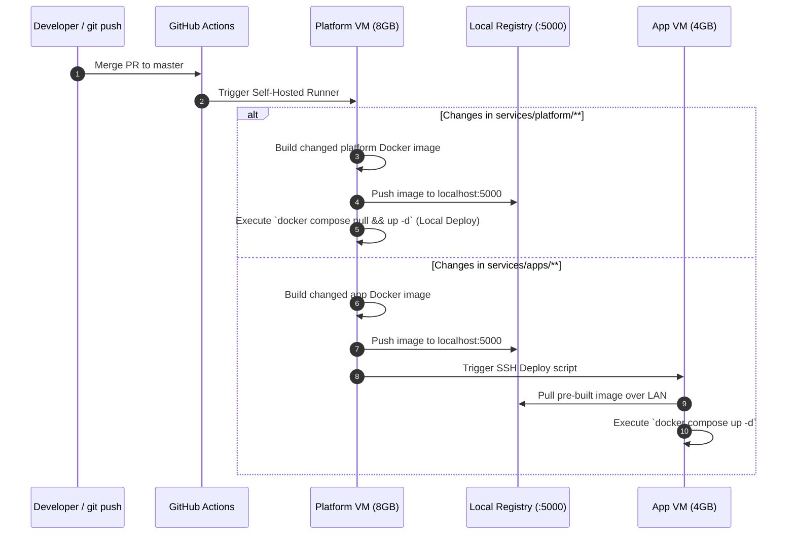

# Homelab Data Platform Architecture

## Overview
A personal data platform designed for low-overhead, resource-constrained homelab hardware. The system aggregates real-time and scheduled telemetry from heterogenous small services into a central MinIO S3 Data Lake, backed by relational storage, identity management, and web analytics dashboards.

---

## Infrastructure Topology & Two-VM Split

```mermaid
graph TD
    subgraph "Platform VM (8GB RAM)"
        REG[Local Docker Registry :5000]
        RUN[Self-Hosted CI Runner]
        PG[(Postgres Database :5432)]
        S3[(MinIO Data Lake :9000)]
        MQTT[Mosquitto MQTT Broker :1883]
        AIR[Apache Airflow Orchestrator :8080]
        MON[Prometheus + Loki + Grafana]
    end

    subgraph "App VM (4GB RAM)"
        API[Backend API :8000]
        WEB[Frontend Dashboard :3000]
        IAM[Keycloak IAM :8080]
        SCR[Bus Scraper]
        HLT[Health Ingester :8001]
        IRR[Irrigation MQTT Client]
    end

    RUN -- "Build & Push Images" --> REG
    API -- "Read/Write" --> PG
    API -- "Query Parquet" --> S3
    SCR -- "Save Raw CSV/JSON" --> S3
    IRR -- "Subscribe Topics" --> MQTT
    IRR -- "Stream Telemetry" --> S3
    HLT -- "Stream Stats" --> S3
    API -- "Authenticate Tokens" --> IAM
    API -- "Pull Pre-built Images over LAN" --> REG
```

---

## Hardware Split Rationale

| Server VM | Memory | Primary Purpose | Key Services |
| :--- | :--- | :--- | :--- |
| **Platform VM** | `8GB RAM` | Stateful, shared data storage, pipeline orchestration, monitoring stack, and local image builds. | Postgres, MinIO, Mosquitto, Airflow, Prometheus, Loki, Grafana, Local Registry, GitHub Runner |
| **App VM** | `4GB RAM` | Lightweight application services, web dashboards, scrapers, and telemetry ingestion clients. | Backend API, Next.js Frontend, Keycloak, Bus Scraper, Health Ingester, Irrigation MQTT |

> [!IMPORTANT]
> **Zero Builds on App VM**: To prevent memory spikes, high CPU contention, and Out-Of-Memory (OOM) kernel kills on the 4GB App VM, **Docker images are NEVER built on the App VM**. All container compilation is performed on the 8GB Platform VM runner. The App VM only ever *pulls* pre-built images over the local LAN.

---

## CI/CD Workflow & Branching Logic

### Path Filtering & Concurrency Controls
1. **Path-Based Branching**: CI uses path filters (`dorny/paths-filter`) so changes to `services/apps/bus-scraper/**` will never trigger a rebuild of Airflow or Frontend.
2. **Strict Concurrency Limits**: CI jobs enforce `concurrency: 1` per pipeline group. This ensures only a single image compilation runs at any given time, preserving CPU/RAM capacity on the 8GB Platform VM.
